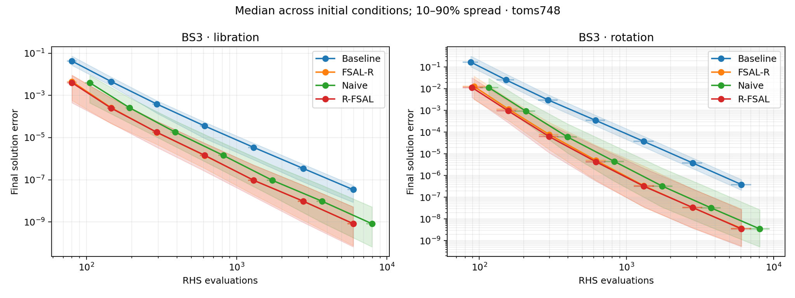
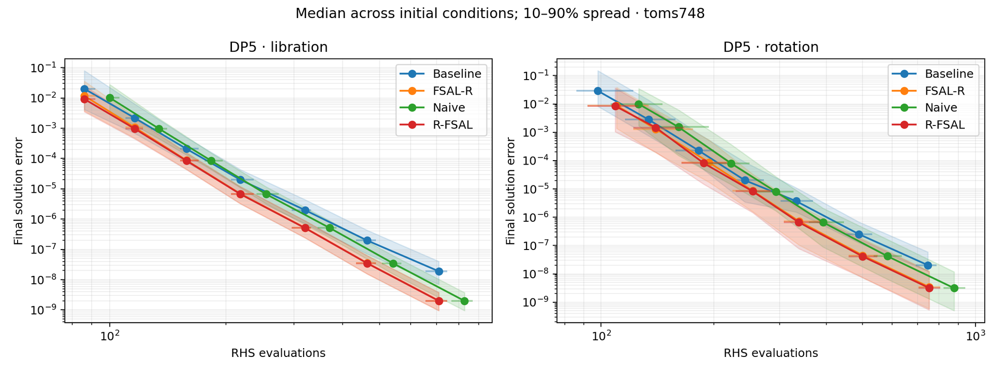
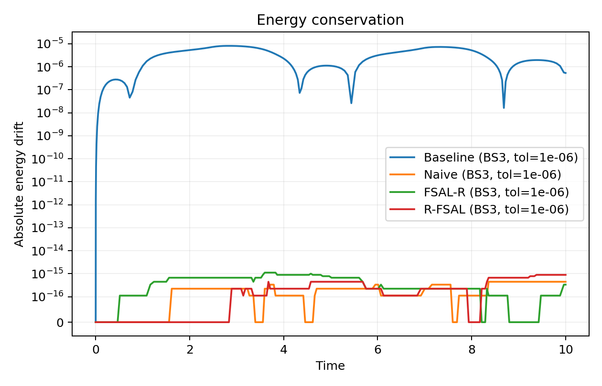
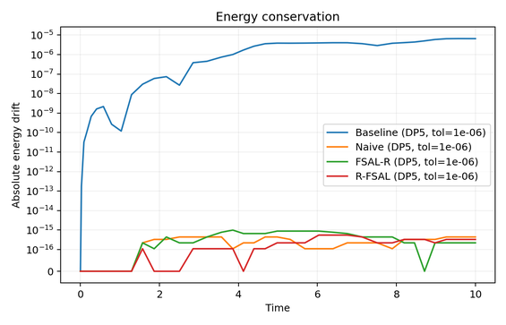
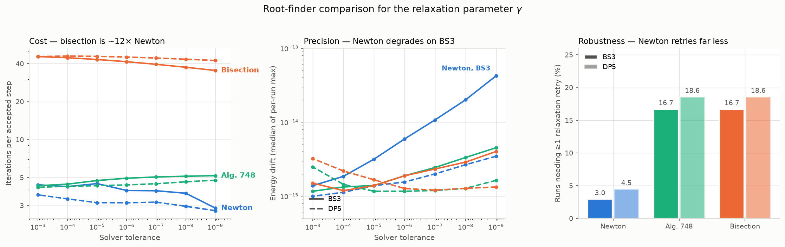

# Performance Evaluation and Monte Carlo Stress-Testing of Relaxation FSAL Runge–Kutta Schemes

**Application to Conservative Systems: Nonlinear Pendulum Analysis**

CSE 402: Numerical Analysis, Simulation and Modeling Sessional
Section C1, Group 4 — Department of Computer Science and Engineering,
Bangladesh University of Engineering and Technology (BUET)

## Team

| Member | Student ID | Responsibility |
|---|---|---|
| Prachurja Dhar (lead) | 2105150 | Shared interfaces (`contracts.py`), pendulum problem (`problems.py`), algorithm specification (`docs/ALGORITHMS.md`), report |
| MD. Abir Hossain | 2105133 | Butcher tableaus (`tableaus.py`), error estimate and PID controller (`stepping.py`) |
| MD. Shadman Shafie | 2105134 | Root-finders (`rootfind.py`), baseline / naive / FSAL-R solvers (`solvers/classic.py`),report |
| Asikur Rahman | 2105144 | R-FSAL solver (`solvers/rfsal.py`), Monte Carlo sweep (`montecarlo.py`) |
| Tousif Fahmeed Quadir | 2105127 | Analysis, figures and summary tables (`analysis.py`),report |

## Contents

- [Overview](#overview)
- [The four methods](#the-four-methods)
- [Repository structure](#repository-structure)
- [Installation](#installation)
- [Quick start](#quick-start)
- [Reproducing the experiments](#reproducing-the-experiments)
- [Verification](#verification)
- [Results](#results)
- [Deviations from the reference implementation](#deviations-from-the-reference-implementation)
- [Design decisions](#design-decisions)
- [Limitations and known issues](#limitations-and-known-issues)
- [Citation and acknowledgements](#citation-and-acknowledgements)
- [License](#license)

## Overview

Explicit Runge–Kutta (RK) methods do not preserve invariants such as the energy of a
conservative system, so the numerical energy drifts. **Relaxation** fixes this: after
each ordinary step it moves to

$$u^{n+1}_\gamma = u^n + \gamma\,(u^{n+1} - u^n), \qquad \eta(u^{n+1}_\gamma) = \eta(u^n),$$

where the relaxation parameter $\gamma \approx 1$ is the root of a scalar nonlinear
equation. Combined with the **first-same-as-last (FSAL)** property of methods such as
BS3 and DP5, however, relaxation costs one extra right-hand-side (RHS) evaluation per
step, because the cached last stage $f(u^{n+1})$ belongs to the wrong point. Bleecke
and Ranocha (2026) remove this cost with two new schemes, **FSAL-R** and **R-FSAL**.

This repository contains our independent Python implementation of those schemes and
extends the original study in three directions:

1. **Nonlinear pendulum, both regimes.** We apply all four variants to
   $\theta'' + \tfrac{g}{L}\sin\theta = 0$ with invariant
   $\eta = \tfrac12\omega^2 - \tfrac{g}{L}\cos\theta$, and report libration
   ($\eta < 1$, swinging) and rotation ($\eta > 1$, passing over the top) separately.
   The authors' technical report also uses this pendulum, but from a single initial
   condition; the published paper's experiment is the Benjamin–Bona–Mahony equation.
2. **Root-finder comparison for $\gamma$.** Newton–Raphson, bisection and
   Algorithm 748, compared on iterations per step, attainable energy conservation and
   failure rate.
3. **Monte Carlo stress test.** 1000 random initial conditions × 2 tableaus ×
   7 tolerances × every method/root-finder combination = **140,000 runs**.

## The four methods

| Variant | Where relaxation happens | Next step's first stage | RHS calls/step (BS3 / DP5) |
|---|---|---|---|
| Baseline | none | $f(u^{n+1})$, reused (FSAL) | 3 / 6 |
| Naive | after the error test | $f(u^{n+1}_\gamma)$, new evaluation | 4 / 7 |
| FSAL-R | after the error test | $f(u^n) + \gamma\,\big(f(u^{n+1}) - f(u^n)\big)$, interpolated | 3 / 6 |
| R-FSAL | before the error test | $f(u^{n+1}_\gamma)$, exact; the skipped $f(u^{n+1})$ is extrapolated as $f(u^n) + \tfrac{1}{\gamma}\big(f(u^{n+1}_\gamma) - f(u^n)\big)$ for the error estimate | 3 / 6 |

`docs/ALGORITHMS.md` gives the full pseudocode of all four loops, the RHS-count
identities, and a hand-traced BS3 step to check an implementation against.

## Repository structure

```
src/
  contracts.py        shared types: State, Problem, Tableau, RootResult, SolverResult
  problems.py         pendulum RHS, invariant and gradient, regime classification,
                      high-accuracy reference solution, seeded initial-condition sampler
  tableaus.py         BS3 and DP5 as exact rationals, float copies, order conditions,
                      PID controller gains
  stepping.py         scaled error estimate, PID step-size controller,
                      initial step-size heuristic
  rootfind.py         Newton, bisection and Algorithm 748 behind one interface
  solvers/
    classic.py        baseline, naive and FSAL-R (one shared loop)
    rfsal.py          R-FSAL
  montecarlo.py       sweep harness: one CSV row per run, parallel, reproducible
  analysis.py         work-precision diagrams, energy-drift plots, summary tables
tests/                one test module per source module (see Verification)
docs/
  ALGORITHMS.md       pseudocode of the four solver loops, deviations from the
                      authors' code, RHS accounting, hand-traced reference step
  figures/            result figures shown in this README
results/              generated data and figures (git-ignored)
requirements.txt      minimum package versions
```

Every module starts with a docstring explaining what it does and why; every public
function documents its arguments and return values.

## Installation

Requires **Python 3.10 or newer** (developed and tested on Python 3.12).

```bash
git clone git@github.com:Legenddipro/Numerical_Project.git
cd Numerical_Project
python3 -m venv venv
source venv/bin/activate          # Windows: venv\Scripts\activate
pip install -r requirements.txt
```

Dependencies: NumPy, SciPy (`solve_ivp` for the reference solution,
`optimize.toms748` for Algorithm 748), Matplotlib, pandas and pytest.

Run every command below from the repository root, with the virtual environment active.

## Quick start

Integrate the authors' pendulum setup — $(\omega_0, \theta_0) = (1.5, 1.0)$ on
$t \in [0, 10]$ — with BS3 at tolerance $10^{-6}$ using all four methods:

```python
from src.problems import make_pendulum
from src.tableaus import BS3
from src.rootfind import ROOT_FINDERS
from src.solvers.classic import solve_baseline, solve_naive, solve_fsalr
from src.solvers.rfsal import solve_rfsal

problem = make_pendulum()  # u0 = (omega, theta) = (1.5, 1.0), t in [0, 10]
for solve in (solve_baseline, solve_naive, solve_fsalr, solve_rfsal):
    r = solve(problem, BS3, 1e-6, rootfinder=ROOT_FINDERS["toms748"], save_history=True)
    drift = max(abs(e - r.entropy_history[0]) for e in r.entropy_history)
    print(f"{r.method:9s} nf={r.nf:4d}  error={r.error_final:.1e}  max energy drift={drift:.1e}")
```

Output:

```
baseline  nf= 611  error=1.4e-05  max energy drift=8.1e-06
naive     nf= 814  error=2.5e-06  max energy drift=1.6e-15
fsalr     nf= 611  error=2.6e-06  max energy drift=1.2e-15
rfsal     nf= 611  error=2.5e-06  max energy drift=6.7e-16
```

The whole result in four lines: naive relaxation conserves energy but costs $4/3$ as
many RHS evaluations; FSAL-R and R-FSAL conserve energy at exactly the baseline's cost,
and are about five times more accurate than the baseline.

All four solvers share one signature and return a `SolverResult`
(`src/contracts.py`). Swap `BS3` for `DP5`, or `"toms748"` for `"newton"` or
`"bisection"`.

## Reproducing the experiments

### 1. Run the tests

```bash
python -m pytest -q
```

Expected: `175 passed, 12 skipped` in about 20 seconds. The skips are explained under
[Verification](#verification).

### 2. Run the Monte Carlo sweep

A smoke test first (50 initial conditions, 7,000 runs, a few minutes):

```bash
python -m src.montecarlo --n 50 --seed 0 --workers 4
```

The full sweep used for the report:

```bash
python -m src.montecarlo --n 1000 --seed 0 --workers 2 --out results/mc_n1000_seed0.csv
```

This writes 140,000 rows (about 47 MB) and took about 76 minutes on 2 cores. Add
`--estimate-only` to print a runtime estimate without running anything.

| Option | Default | Meaning |
|---|---|---|
| `--n` | `50` | number of random initial conditions |
| `--seed` | `0` | random seed; the same seed gives byte-identical output |
| `--regime` | `both` | `libration`, `rotation` or `both` |
| `--workers` | all cores | parallel processes; the result does not depend on this |
| `--tableaus` | `BS3 DP5` | Butcher tableaus to run |
| `--methods` | `baseline naive fsalr rfsal` | solver variants to run |
| `--finders` | `bisection newton toms748` | root-finders for $\gamma$ |
| `--tols` | `1e-3 … 1e-9` | tolerances (7 values) |
| `--t-end` | `10.0` | final time |
| `--out` | `results/mc_n<N>_seed<S>_<regime>.csv` | output CSV |

Each row records the configuration (initial condition, regime, tableau, tolerance,
method, root-finder), a status, the counters of `SolverResult` (RHS evaluations,
accepted/rejected steps, root-finder iterations, relaxation failures), the final error,
the maximum energy drift and statistics of $|\gamma - 1|$. A run that raises an
exception is stored as a `failed` row and the sweep continues.

### 3. Analyse the results

```bash
python -m src.analysis results/mc_n1000_seed0.csv --out results/analysis
```

Writes, for every tableau and root-finder:

- `work_precision_<tableau>_<finder>.png` — final error against RHS evaluations,
  median over initial conditions with 10–90% bands, libration and rotation side by side,
  plus a companion CSV with the exact plotted numbers;
- `rootfinder_comparison.csv` — iterations, failure rates and energy drift per finder;
- `monte_carlo_summary.csv` — means, medians, quantiles and extrema of every metric.

Energy-drift time series need the full history, which the sweep does not store. Make
them from single runs with `save_history=True`:

```python
from src.analysis import energy_drift_plot
results = [solve(problem, BS3, 1e-6, rootfinder=ROOT_FINDERS["toms748"], save_history=True)
           for solve in (solve_baseline, solve_naive, solve_fsalr, solve_rfsal)]
energy_drift_plot(results, "results/energy_BS3.png")
```

## Verification

Before any experiment was trusted, the implementation had to pass six gates:

| Gate | Question | Evidence | Where tested | Status |
|---|---|---|---|---|
| G1 | Do all root-finders agree on $\gamma$? | all three give $\gamma = 1.0036353183$ on the reference step | `test_rootfind.py` | passed |
| G2 | Do the solvers have the right order? | halving $\Delta t$ cuts the error by 7.99 (BS3, expect 8) and 33.5 (DP5, expect 32) | `test_classic.py` | passed |
| G3 | Is every RHS evaluation accounted for? | `nf` equals $c_0 + (s-1)(n_\text{acc} + n_\text{rej})$ exactly, $+\,n_\text{acc}$ for naive, $-\,n_\text{fail}$ for R-FSAL | `test_classic.py`, `test_rfsal.py`, `test_montecarlo.py` | passed |
| G4 | Does relaxation conserve energy? | relaxed drift $\sim 10^{-15}$ against $10^{-2}$–$10^{-8}$ for baseline | `test_classic.py`, `test_rfsal.py` | passed |
| G5 | Do our numbers match the authors' Julia code? | needs a reference table from the Julia code | `test_rfsal.py` | **not run** |
| G6 | Does $\gamma$ behave as theory predicts, $\gamma = 1 + O(\Delta t^{p-1})$? | measured slopes of $|\gamma - 1|$ against tolerance: 0.64 (BS3, theory 2/3) and 0.81 (DP5, theory 4/5) | `test_montecarlo.py` | passed |

A further check, the **reference step** from $(\omega, \theta) = (1.5, 1.0)$ with
$\Delta t = 0.4$, is computed by hand in `docs/ALGORITHMS.md` and asserted to 7+
digits in `test_tableaus.py`, `test_stepping.py` and `test_rfsal.py`. Butcher
coefficients are checked against the order conditions in exact rational arithmetic.

**Skipped tests.** `tests/test_gates.py` holds 11 placeholders for cross-module gate
tests; they are skipped because each gate is already tested inside the module that
owns it (the "Where tested" column). The twelfth skip is G5.

## Results

From the full sweep (1000 initial conditions, seed 0: 648 libration, 352 rotation).
All 140,000 runs completed. The work-precision diagrams come from
`python -m src.analysis`, and the energy plots from `energy_drift_plot` (see
[Reproducing the experiments](#reproducing-the-experiments)).

**Cost and accuracy** — median over initial conditions, tolerance $10^{-6}$:

| Method | BS3 RHS calls | BS3 error | DP5 RHS calls | DP5 error |
|---|---|---|---|---|
| Baseline | 612.5 | $4.6\times10^{-5}$ | 230 | $2.0\times10^{-5}$ |
| Naive | 816 | $2.0\times10^{-6}$ | 266 | $7.0\times10^{-6}$ |
| FSAL-R | 614 | $2.0\times10^{-6}$ | 230 | $7.0\times10^{-6}$ |
| R-FSAL | 614 | $2.0\times10^{-6}$ | 230 | $7.0\times10^{-6}$ |

**Work–precision diagrams** — final error against RHS evaluations, one point per
tolerance ($10^{-3}$ to $10^{-9}$), median over initial conditions with 10–90% bands;
Algorithm 748 for $\gamma$. Lower-left is better.





For both tableaus and both regimes, FSAL-R and R-FSAL sit on top of each other and reach
the naive method's accuracy at the baseline's cost: their curves are the naive curve
shifted left by the one saved evaluation per step. The baseline curve lies above them,
most clearly for BS3: relaxation reduces the solution error as well as the energy
error.

**Energy conservation.** Relaxed methods kept the maximum energy drift at or below
$1.2\times10^{-12}$ in every run; the baseline drifted by up to $0.19$. Over a single
run (the authors' initial condition, tolerance $10^{-6}$), the baseline's drift climbs
to $10^{-6}$–$10^{-5}$, while all three relaxed methods stay at
the level of floating-point rounding ($\le 10^{-15}$; the axis is linear below
$10^{-16}$ so that exact zeros can be shown):

| BS3 | DP5 |
|---|---|
|  |  |

**Root-finders** (pooled over both regimes):

| | Newton | Algorithm 748 | Bisection |
|---|---|---|---|
| Iterations per accepted step | ≈ 3.5 | ≈ 4.5 | ≈ 42 |
| Runs needing ≥ 1 relaxation retry, BS3 / DP5 | 3.0% / 4.5% | 16.7% / 18.6% | 16.7% / 18.6% |



Left: iterations per accepted step against tolerance (solid BS3, dashed DP5) —
bisection costs about 12 times as much as Newton. Middle: median of each run's maximum
energy drift — all three stay within $10^{-15}$–$10^{-13}$, but Newton's drift on BS3
grows as the tolerance tightens. Right: share of runs that needed at least one
relaxation retry — Newton retries far less, because it does not need a sign change
across the bracket.

**Where relaxation fails.** Runs with at least one failed $\gamma$ solve:

| Root-finder | Libration | Rotation |
|---|---|---|
| Bisection / Algorithm 748 | 0.05% | 50% |
| Newton | 0.05% | 10% |

Failures concentrate in rotation, where the equation for $\gamma$ often has no sign
change inside the fixed bracket $[0.8, 1.2]$. Newton starts from $\gamma = 1$ and needs
no sign change, so it fails far less. Every failure is handled by rejecting the step and
halving $\Delta t$, so no run was lost.

## Deviations from the reference implementation

Our solver loops are ported from the authors' Julia code, with three deliberate
departures documented in `docs/ALGORITHMS.md` and commented at the lines where they
apply:

1. **Baseline counts its accepted steps.** The source's baseline branch never calls
   `accept_step!` or increments `naccept`, so it reports 0 accepted steps and its PID
   controller never updates its error history. Ours does both.
2. **A failed $\gamma$ solve really rejects the step.** In the source, a later
   assignment always resets the relaxation flag, so the "halve the step and retry"
   branch can never run (it also contains a typo, `integrator *= 0.5`, that would
   raise an error if it did). A step with no root in the bracket is silently accepted
   with $\gamma = 1$, i.e. without relaxation. Ours rejects it and halves $\Delta t$.
3. **R-FSAL's RHS count has a correction term.** A failed relaxation in R-FSAL returns
   before its one evaluation at $u^{n+1}_\gamma$, so that attempt costs one evaluation
   less; gate G3 accounts for it with $-\,n_\text{fail}$.

**Root-finder note.** The paper cites Algorithm 748 (Alefeld, Potra & Shi, 1995); the
authors' code calls `Roots.AlefeldPotraShi()`, a closely related bracketing method by
the same authors. We use SciPy's `toms748`, which implements Algorithm 748.

## Design decisions

- **Plain tuples, not NumPy arrays, for the state.** With two components, NumPy's
  per-call overhead (≈ 1 µs) far exceeds the arithmetic (≈ 50 ns); scalar `math`
  functions are about 20× faster here.
- **Exact coefficients.** Every Butcher coefficient is written once as a
  `fractions.Fraction`; the floats the solvers use are derived from it, so a mistyped
  digit fails an exact order-condition test instead of quietly degrading the method.
- **One shared controller and one shared loop.** All variants use the same PID
  controller, and baseline, naive and FSAL-R share one loop, so any difference in their
  results comes from the relaxation scheme, not from incidental code differences.
- **Reproducibility.** The sampler requires an explicit seed, each initial condition
  gets a seed derived from it, and the sweep output is byte-identical regardless of the
  number of workers.
- **One owner per file.** Each module has one owner, so five people could work in
  parallel on one branch without merge conflicts.

## Limitations and known issues

- **G5 was not run.** No reference table was generated from the authors' Julia code, so
  agreement with their numbers is shown by trend (work-precision diagrams), not digit by
  digit.
- **Fixed bracket.** $[0.8, 1.2]$ is too narrow for rotation at loose tolerances, which
  causes most relaxation failures. An adaptive bracket is a natural next step.
- **Newton's precision on BS3.** Newton's energy drift grows at tight tolerances on
  BS3 (still near $10^{-14}$, far below the baseline's).
- **Generated data is not in the repository.** `results/` is git-ignored; regenerate it
  with the commands above.

## Citation and acknowledgements

This project builds directly on the methods and reference implementation of:

```bibtex
@article{bleecke2026relaxation,
  title={Relaxation {R}unge-{K}utta methods with First-Same-as-Last
         Structure},
  author={Bleecke, Sebastian and Ranocha, Hendrik},
  journal={Journal of Scientific Computing},
  volume={106},
  pages={18},
  year={2026},
  doi={10.1007/s10915-025-03130-6},
  eprint={2311.14050},
  eprinttype={arxiv},
  eprintclass={math.NA}
}
```

Our solver loops are ported from the authors' reproducibility repository, which their
README asks to be cited alongside the article:

```bibtex
@misc{bleecke2026relaxationRepro,
  title={Reproducibility repository for
         "{R}elaxation {R}unge-{K}utta methods with First-Same-as-Last
         Structure"},
  author={Bleecke, Sebastian and Ranocha, Hendrik},
  year={2023},
  howpublished={\url{https://github.com/ranocha/2023_FSAL_relaxation}},
  doi={10.5281/zenodo.10201246}
}
```

Original repository: https://github.com/ranocha/2023_FSAL_relaxation (MIT licensed).
To consult it locally, clone it next to this project; `.gitignore` already excludes it:

```bash
git clone https://github.com/ranocha/2023_FSAL_relaxation.git
```

## License

MIT — see [LICENSE](LICENSE).
